### 이번 pjt 를 통해 배운 내용
* 데이터를 생성, 조회, 수정, 삭제할 수 있는 Web application 제작
* Django web framework를 사용한 데이터 처리
* Django Model과 ORM에 대한 이해
* Django ModelForm을 활용한 사용자 요청 데이터 유효성 검증

## A. Model

* 요구 사항 : Movie를 이름으로 하는 모델 클래스를 정의하고 주어진 정보를 저장

* 결과
  
  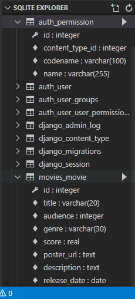
  
  * 문제 접근 방법 및 코드 설명
  
  ```python
  # movies/models.py
  class Movie(models.Model):
    title = models.CharField(max_length=20)
    audience = models.IntegerField()
    release_date = models.DateField()
    genre = models.CharField(max_length=30)
    score = models.FloatField()
    poster_url = models.TextField()
    description = models.TextField()
  ```
  
  * 이 문제에서 어려웠던점
    * forms.py와 헷갈려서 어지러웠다..
  * 내가 생각하는 이 문제의 포인트
    * 필드만 설정하고 forms.py에서 다듬기 !

-----

## B. Form

* 요구 사항 : 
  
  * Movie 모델의 데이터 검증, 저장, 에러메세지, HTML을 관리하기 위해 ModelForm을 사용
  * genre 필드 : select element를 출력해 코미디, 공포, 로맨스 장르 데이터를 선택
  * score 필드 : input type은 number, step은 0.5, min=0, max=5
  * release_date 필드 : input type은 date

* 결과
  
  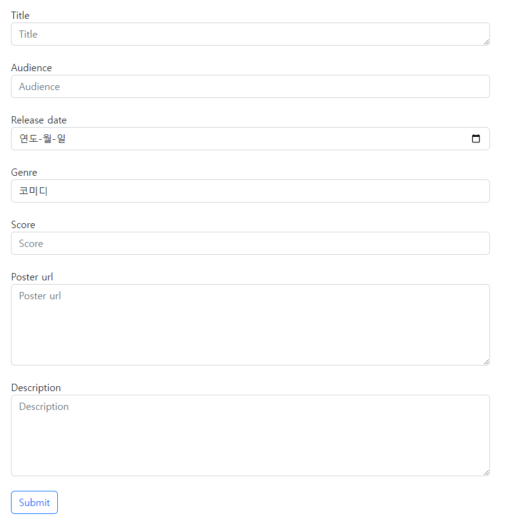
  
  * 문제 접근 방법 및 코드 설명

```python
from django import forms
from .models import Movie

Genre_Choices = [
    ('genre_1', '코미디'), 
    ('genre_2', '공포'), 
    ('genre_3', '로맨스'),
]

class MovieForm(forms.ModelForm):
    title = forms.CharField(
        label='Title',
        widget=forms.Textarea(
            attrs={
                'class': 'my-title form-control',
                'placeholder': 'Title',
                'rows': 1,
                'cols': 100,
            }
        )
    )
    audience = forms.IntegerField(
        label='Audience',
        widget=forms.NumberInput(
            attrs={
                'class': 'my-audience form-control',
                'placeholder': 'Audience',
                'rows': 1,
                'cols': 100,
            }
        )
    )
    poster_url = forms.CharField(
        label='Poster url',
        widget=forms.Textarea(
            attrs={
                'class': 'my-url form-control',
                'placeholder': 'Poster url',
                'rows': 5,
                'cols': 100,
            }
        )
    )
    description = forms.CharField(
        label='Description',
        widget=forms.Textarea(
            attrs={
                'class': 'my-description form-control',
                'placeholder': 'Description',
                'rows': 5,
                'cols': 100,
            }
        )
    )
    score = forms.FloatField(
        label='Score',
        widget=forms.NumberInput(
            attrs={
                'class': 'my-score form-control',
                'step': '0.5',
                'min': '0',
                'max': '5',
                'placeholder': 'Score',
            }
        )
    )
    release_date = forms.DateField(
        label='Release date',
        widget=forms.NumberInput(
            attrs={
                'type': 'date',
                'class':'my-release_date form-control',
                'placeholder': '연도-월-일',
            }
        )
    )
    genre = forms.CharField(
        label='Genre',
        widget=forms.Select(
            choices=Genre_Choices,
            attrs={
                'class': 'my-genre form-control',
            }
        ),
    )
    class Meta:
        model = Movie
        fields = '__all__'
```

* 이 문제에서 어려웠던점
* 내가 생각하는 이 문제의 포인트
  * widget, attrs 사용!!!!!!!
    ....

-----

## C. Admin

* 요구 사항 : 모델 Movie를 Admin site에 등록

* 결과
  
  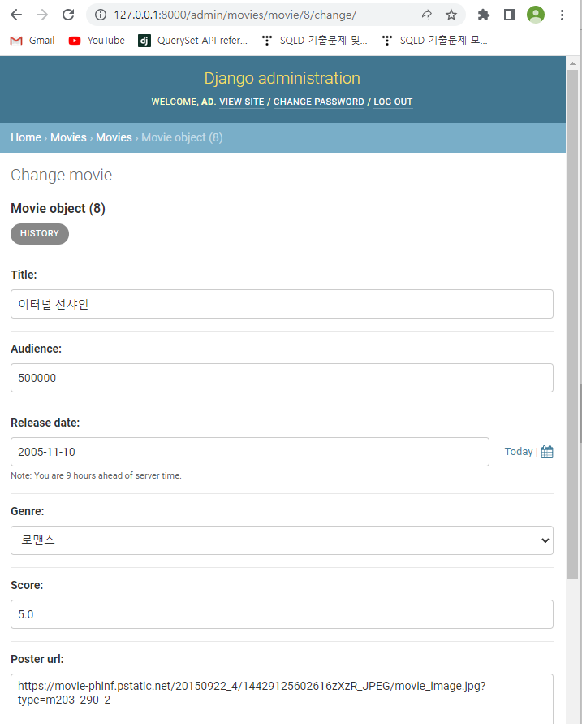
  
  * 문제 접근 방법 및 코드 설명
  
  ```python
  from django.contrib import admin
  from .models import Movie
  
  # Register your models here.
  class MovieAdmin(admin.ModelAdmin):
    pass
  
  admin.site.register(Movie, MovieAdmin)
  ```
  
  * 이 문제에서 어려웠던점
    
    * MovieAdmin을 만들어서 넣어야하는 부분..
  
  * 내가 생각하는 이 문제의 포인트
    ....

-----

## D. View

* 요구 사항 : 각 역할을 하는 view 함수 생성

* 결과
  
  * 문제 접근 방법 및 코드 설명

```python
# movies/views.py
from django.shortcuts import render, redirect
from .models import Movie
from .forms import MovieForm
from django.views.decorators.http import (
    require_http_methods,
    require_POST,
    require_safe
)

# Create your views here.

# 전체 영화 데이터 조회 및 index.html 렌더링
@require_safe
def index(request):
    movies = Movie.objects.all()
    context = {
        'movies': movies,
    }
    return render(request, 'movies/index.html', context)

# create.html 렌더링
# 유효성 검증 및 영화 데이터 저장 후 detail.html 리다이렉트
@require_http_methods(['GET', 'POST'])
def create(request):
    if request.method == 'POST':
        form = MovieForm(request.POST)
        if form.is_valid():
            form.save()
            return redirect('movies:index')
    else:
        form = MovieForm()
    context = {
        'form': form,
    }
    return render(request, 'movies/create.html', context)

# 단일 영화 데이터 조회 및 detail.html 렌더링
@require_safe
def detail(request, pk):
    movie = Movie.objects.get(pk=pk)
    context = {
        'movie': movie,
    }
    return render(request, 'movies/detail.html', context)

# 수정 대상 영화 데이터 조회 및 update.html 렌더링
# 유효성 검증 및 영화 데이터 수정 후 detail.html 리다이렉트
@require_http_methods(['GET', 'POST'])
def update(request, pk):
    movie = Movie.objects.get(pk=pk)
    if request.method == 'POST':
        form = MovieForm(request.POST, instance=movie)
        if form.is_valid():
            form.save()
            return redirect('movies:detail', movie.pk)
    else:
        form = MovieForm(instance=movie)
    context = {
        'movie': movie,
        'form': form,
    }
    return render(request, 'movies/update.html', context)

# 단일 영화 데이터 삭제 및 index.html 리다이렉트
@require_POST
def delete(request, pk):
    movie = Movie.objects.get(pk=pk)
    movie.delete()
    return redirect('movies:index')
```

* 이 문제에서 어려웠던점
* 내가 생각하는 이 문제의 포인트
  * 흐름을 아는게 젤 중요중요중요
  ....

-----

## E. index.html

* 요구 사항 :  
  
  * DB에 존재하는 모든 영화의 목록을 표시
  * 영화 제목, 평점을 표시하고 제목 클릭 시 해당 영화의 상세 조회 페이지로 이동
  * +index화면에 DB에 있는 영화들의 포스터를 자동슬라이싱하면서 보여주기
    * +평점 top5의 포스터를 뽑아서 보여주는 걸로 `수정해보기`
    * +포스터를 누르면 해당 영화의 세부사항 페이지로 이동하도록 `수정해보기`
  * +login 유무에 따라 상단바에 보여지는 것 다르게 (맨 아래에 사진첨부)

* 결과
  
  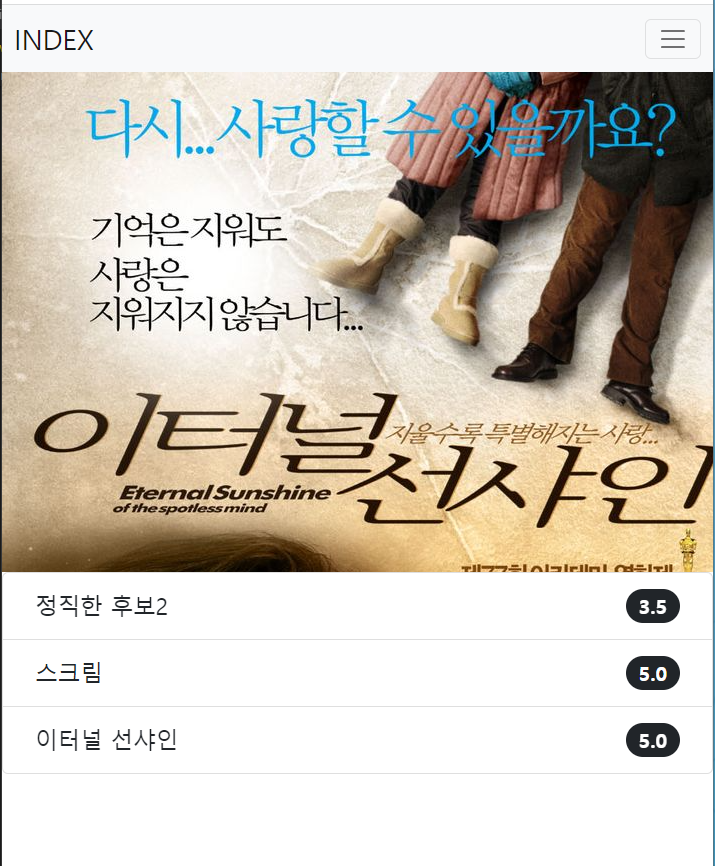

* 문제 접근 방법 및 코드 설명

```html



     <h1>INDEX</h1>
    <a href="">CREATE</a>
    <hr>
    
        <a href="">{{ movie.title }}</a>
        <br>
        {{ movie.score }}
        <hr>
     

    <nav class="navbar navbar-expand-lg bg-light">
        <div class="container-fluid">
          <a class="navbar-brand fs-2" href="#">INDEX</a>
          <button class="navbar-toggler" type="button" data-bs-toggle="collapse" data-bs-target="#navbarSupportedContent" aria-controls="navbarSupportedContent" aria-expanded="false" aria-label="Toggle navigation">
            <span class="navbar-toggler-icon"></span>
          </button>
          <div class="collapse navbar-collapse" id="navbarSupportedContent">
            <ul class="navbar-nav me-auto mb-2 mb-lg-0">
              <li class="nav-item">
                <a class="nav-link active fs-4 text-danger" aria-current="page" href="">CREATE</a>
              </li>
              
              <li class="nav-item">
                <a class="nav-link active fs-4" aria-current="page" href="">{{ request.user }}님, 정보수정</a>
              </li>
              <li class="nav-item">
                <form action="" method='POST'>
                  
                   <input type="submit" value='Logout'> 
                  <button type='submit' class='btn btn-link nav-link active fs-4'>Logout</button>
                </form>
              </li>
              <li class="nav-item">
                <form action="" method='POST'>
                  
                   <input type="submit" value='회원탈퇴'> 
                  <button type='submit' class='btn btn-link nav-link active fs-4'>회원탈퇴</button>
                </form>
              </li>
              
              <li class="nav-item">
                <a class="nav-link active fs-4" aria-current="page" href="">Login</a>
              </li>
              <li class="nav-item">
                <a class="nav-link active fs-4" aria-current="page" href="">Signup</a>
              </li>
              
            </ul>
          </div>
        </div>
      </nav>

   DB에 저장돼있는 영화 포스터 슬라이드 
  <div id="carouselExampleSlidesOnly" class="carousel slide" data-bs-ride="carousel">
      <div class="carousel-inner" style='position: relative; width: 3000px; height: 500px; overflow: hidden;'>
        
          <div class="carousel-item active" style='position: absolute; top: -200px; left: 0; width: 500px; height: 500px;'>
          
      </div>
      
      </div>
  </div>

  
  <ul class="list-group">
    
    <li class="list-group-item d-flex justify-content-between align-items-center">
        <a class='text-decoration-none text-dark my-2 ms-3 fs-4' href="">{{ movie.title }}</a>
      <span class="badge bg-dark rounded-pill fs-5 me-3">{{ movie.score }}</span>
    </li>
    
  </ul>
  
  <a class="d-flex justify-content-center mt-5 fs-2 text-decoration-none text-danger" aria-current="page" href="">로그인 후 사용가능 합니다.</a>
  

```

* 이 문제에서 어려웠던점
* 내가 생각하는 이 문제의 포인트
  ....

-----

## F. detail.html

* 요구 사항 
  
  * 특정 영화의 상세 정보를 표시
  * 해당 영화의 수정, 삭제 버튼 표시
  * 전체 영화 목록 조회 페이지로 이동하는 링크 표시

* 결과
  
  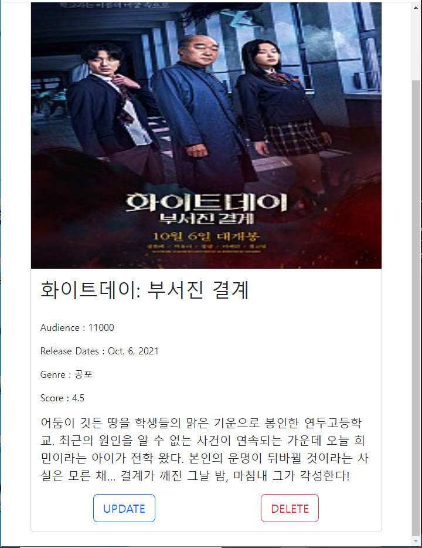
  
  * 문제 접근 방법 및 코드 설명

```html


    <nav class="navbar navbar-expand-lg bg-light">
        <div class="container-fluid">
          <a class="navbar-brand fs-2" href="#">DETAIL</a>
          <button class="navbar-toggler" type="button" data-bs-toggle="collapse" data-bs-target="#navbarSupportedContent" aria-controls="navbarSupportedContent" aria-expanded="false" aria-label="Toggle navigation">
            <span class="navbar-toggler-icon"></span>
          </button>
          <div class="collapse navbar-collapse" id="navbarSupportedContent">
            <ul class="navbar-nav me-auto mb-2 mb-lg-0">
              <li class="nav-item">
                <a class="nav-link active fs-4" aria-current="page" href="">HOME</a>
              </li>
              </li>
            </ul>
          </div>
        </div>
      </nav>
    <div class="card my-4" style="width: 600px; margin: 0 auto;">
        
        <div class="card-body">
          <h5 class="card-title fs-1">{{ movie.title }}</h5>
          <br>
          <p class="card-text">Audience : {{ movie.audience }}</p>
          <p class="card-text">Release Dates : {{ movie.release_date }}</p>
          <p class="card-text">Genre : {{ movie.genre }}</p>
          <p class="card-text">Score : {{ movie.score }}</p>
          <p class="card-text fs-5">{{ movie.description }}</p>
          <div class='d-flex justify-content-around mt-3'>
          <a href="" class="btn btn-lg btn-outline-primary">UPDATE</a>
          <form action="" method='POST'>
            
            <input type="submit" value='DELETE' class="btn btn-lg btn-outline-danger">
          </form>
        </div>
        </div>
      </div>

```

* 이 문제에서 어려웠던점
* 내가 생각하는 이 문제의 포인트
  ....

-----

## G. create.html

* 요구 사항 
  
  * 특정 영화를 생성하기 위한 html form 요소 표시
  * 작성한 정보는 제출시 단일 영화 데이터를 저장하는 url로 요청과 함께 전송
  * 전체 영화 목록 조회 페이지로 이동하는 링크 표시

* 결과
  
  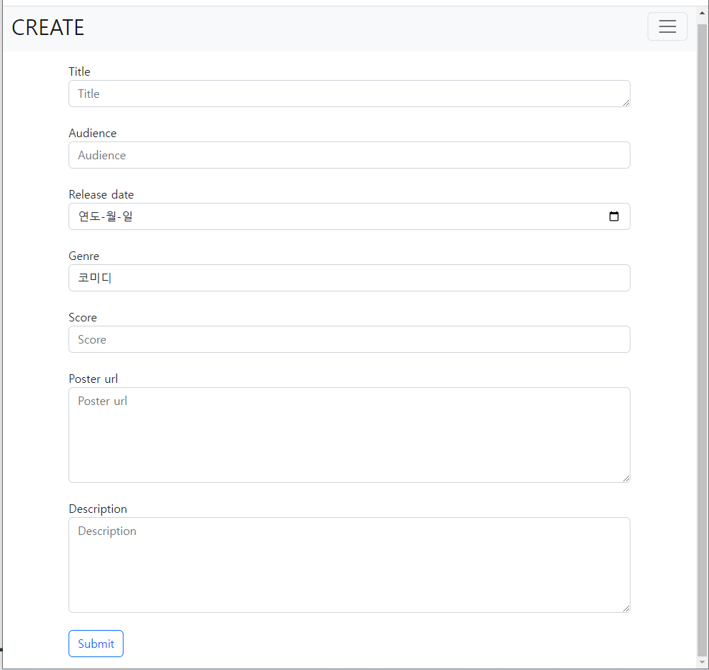
  
  * 문제 접근 방법 및 코드 설명

```html



    <nav class="navbar navbar-expand-lg bg-light">
        <div class="container-fluid">
          <a class="navbar-brand fs-2" href="#">CREATE</a>
          <button class="navbar-toggler" type="button" data-bs-toggle="collapse" data-bs-target="#navbarSupportedContent" aria-controls="navbarSupportedContent" aria-expanded="false" aria-label="Toggle navigation">
            <span class="navbar-toggler-icon"></span>
          </button>
          <div class="collapse navbar-collapse" id="navbarSupportedContent">
            <ul class="navbar-nav me-auto mb-2 mb-lg-0">
              <li class="nav-item">
                <a class="nav-link active fs-4" aria-current="page" href="">HOME</a>
              </li>
              </li>
            </ul>
          </div>
        </div>
      </nav>
    
    <div class='d-flex flex-row justify-content-center m-3'>
        <form action="" method='POST'>
          
          
            {{ field.label }}
            <br>
            <div>
              {{ field }}
            </div>
            <br>
          
          <button type='submit' class='btn btn-outline-primary'>Submit</button>
        </form>
    </div>

```

* 이 문제에서 어려웠던점
  * 처음엔 form을 하나하나 나눠서 (form.title 의 형식) 출력했는데, 라인도 안맞고 답답했다.
  * 쉽게 해결할 수 있는 두가지 방법이 있음!
    * 1. forms.py에서 attrs를 작성 => 이걸로 수정함
    * 2. django-bootstrap
* 내가 생각하는 이 문제의 포인트
  ....

-----

## H. update.html

* 요구 사항 
  
  * 특정 영화를 수정하기 위한 html form 요소 표시
  * html input 요소에는 기존 데이터를 출력
  * cancel 버튼은 사용자의 모든 입력을 초기 값으로 재설정
  * 작성한 정보는 제출시 단일 영화 데이터를 수정하는 url로 요청과 함께 전송
  * 영화 상세 정보 페이지로 이동하는 링크 표시

* 결과
  
  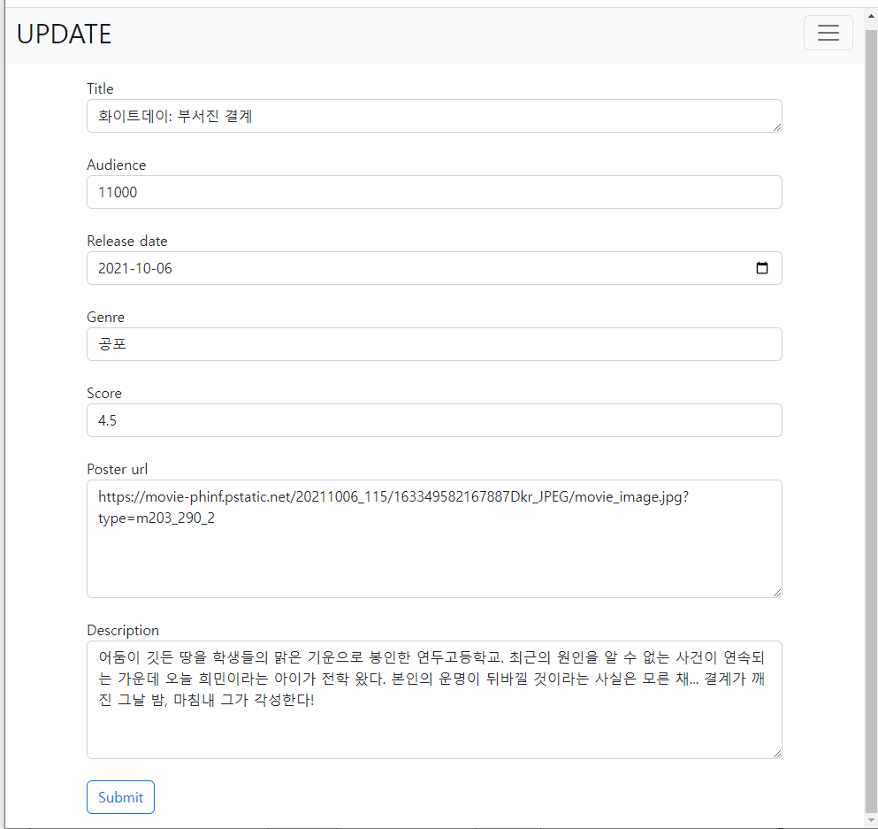
  
  * 문제 접근 방법 및 코드 설명

```html



    <nav class="navbar navbar-expand-lg bg-light">
        <div class="container-fluid">
          <a class="navbar-brand fs-2" href="#">UPDATE</a>
          <button class="navbar-toggler" type="button" data-bs-toggle="collapse" data-bs-target="#navbarSupportedContent" aria-controls="navbarSupportedContent" aria-expanded="false" aria-label="Toggle navigation">
            <span class="navbar-toggler-icon"></span>
          </button>
          <div class="collapse navbar-collapse" id="navbarSupportedContent">
            <ul class="navbar-nav me-auto mb-2 mb-lg-0">
              <li class="nav-item">
                <a class="nav-link active fs-4" aria-current="page" href="">HOME</a>
              </li>
              </li>
            </ul>
          </div>
        </div>
      </nav>

    <div class='d-flex flex-row justify-content-center m-3'>
        <form action="" method='POST'>
          
          
            {{ field.label }}
            <br>
            <div>
              {{ field }}
            </div>
            <br>
          
          <button type='submit' class='btn btn-outline-primary'>Submit</button>
        </form>
    </div>

```

* 이 문제에서 어려웠던점
  * create랑 동일!
* 내가 생각하는 이 문제의 포인트
  ....

---

## I. accounts app

## 1) Login page

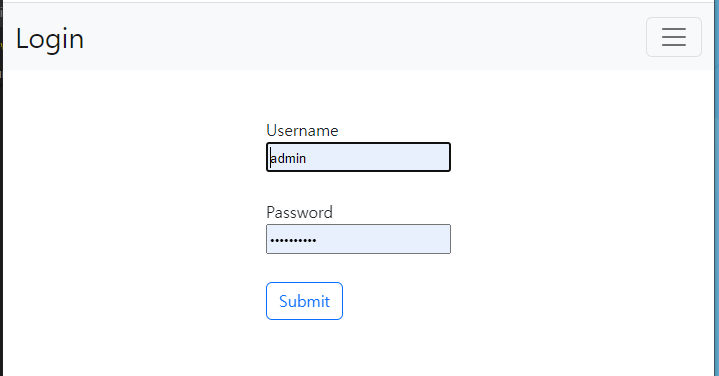


## 2) 회원정보 수정 page

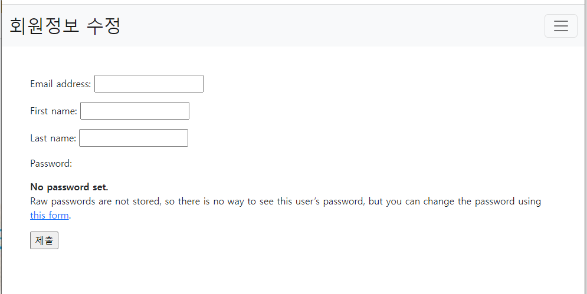


## 3) 비밀번호 변경 page

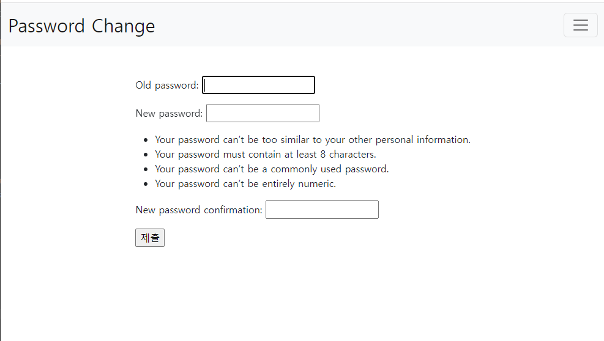


## 4) Login 된 경우 상단바

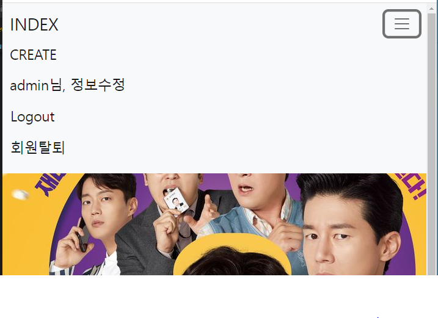

## 5) Login 안된 경우 상단바

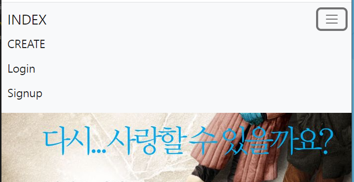

* 아직은 헷갈리는 부분이 있다
* 마찬가지로 흐름을 이해하고 짜기
* decorator 작성 부분 다시 공부해보기

```python
# accounts/views.py
from django.shortcuts import render, redirect
from django.contrib.auth.forms import AuthenticationForm, PasswordChangeForm
from .forms import CustomUserChangeForm, CustomUserCreationForm
from django.contrib.auth import login as auth_login
from django.contrib.auth import logout as auth_logout
from django.contrib.auth import update_session_auth_hash
from django.contrib.auth.decorators import login_required
from django.views.decorators.http import require_http_methods, require_POST, require_safe

# Create your views here.
@require_http_methods(['GET', 'POST'])
def login(request):
    if request.user.is_authenticated:
        return redirect('movies:index')

    if request.method == 'POST':
        form = AuthenticationForm(request, request.POST)
        if form.is_valid():
            auth_login(request, form.get_user())
            next = request.GET.get('next')
            return redirect(next or 'movies:index')
    else:
        form = AuthenticationForm()
    context = {
        'form': form,
    }
    return render(request, 'accounts/login.html', context)

@require_POST
def logout(request):
    if request.user.is_authenticated:
        auth_logout(request)
    return redirect('movies:index')

@require_http_methods(['GET', 'POST'])
def signup(request):
    if request.method == 'POST':
        form = CustomUserCreationForm(request.POST)
        if form.is_valid():
            user = form.save()
            auth_login(request, user)
            return redirect('movies:index')
    else:
        form = CustomUserCreationForm()
    context = {
        'form': form,
    }
    return render(request, 'accounts/signup.html', context)

@require_POST
def delete(request):
    if request.user.is_authenticated:
        request.user.delete()
        auth_logout(request)
    return redirect('movies:index')

@login_required
@require_http_methods(['GET', 'POST'])
def update(request):
    if request.method == 'POST':
        form = CustomUserChangeForm(request.POST, instance=request.user)
        if form.is_valid():
            form.save()
            return redirect('movies:index')
    else:
        form = CustomUserChangeForm(instance=request.user)
    context = {
        'form': form,
    }
    return render(request, 'accounts/update.html', context)

@login_required
@require_http_methods(['GET', 'POST'])
def change_password(request):
    if request.method == 'POST':
        form = PasswordChangeForm(request.user, request.POST)
        if form.is_valid():
            form.save()
            update_session_auth_hash(request, form.user)
            return redirect('movies:index')
    else:
        form = PasswordChangeForm(request.user)
    context = {
        'form': form,
    }
    return render(request, 'accounts/change_password.html', context)
```
-----


* 저번에 했던 거랑 비슷해서 할만했지만, 아직 모델이랑 폼이 어렵다..
* 댓글 app 만들어서 1:N관계 응용해보면서 확장해보기!